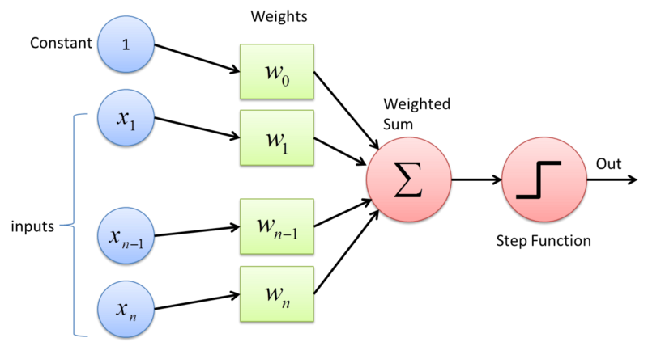
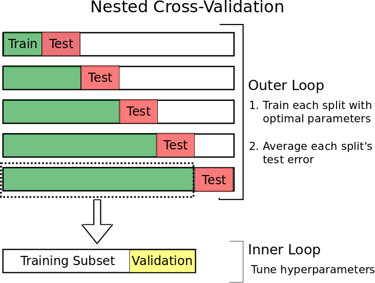

Practice Interview Questions

# Advanced Topics in Data Science

1. **What are stop words?**

   Stop words are words like 'a', 'the', or 'an' that are commonly found in text data, but which provide little or no value to a NLP model. Therefore, stop words are commonly filtered out of text as a part of pre-processing.

2. **Can you explain tokenization and lemmatization?**

   Tokenization is the act of taking a text and breaking it into pieces (i.e. tokens) such as words or sentences.

   Lemmatization (or stemming) is the idea of using a word stem rather than the entire word in order to process all forms of the same word in the same way. For example, "spell", "spelling", and "spelled" might lemmatized to "spell"

3. **Can you explain what is a Bag-of-Words?**

   A bag-of-words is a process of simplifying a text by utilizing a set of words from the text and discarding word order or grammar.

4. **What is the advantage of using TF-IDF instead of simple word counts?**

   TF-IDF uses word counts in the context of the number of documents in which the word appears. This allows us to differentiate between a word that is important in a specific document, as opposed to frequently used in many or all documents.

5. **Can you explain how word2vec works?**

   Word2vec is a method that uses shallow neural nets to generate word embeddings (words represented as vectors). These vectors not only allow for individual words to be represented mathematically, but the spatial relationships between the vectors also have meaning. In the example below from the TensorFlow website, you can see that the distance and direction between 'man' and 'woman' is the same as between 'king' and 'queen'. The same is true of other linguistic relationships as well. 

   

6. **What is topic modeling?**

   Topic modeling is used to determine the probabilities that different topics are associated with a given text.

7. **Can you explain how Latent Dirichlet Allocation works?**

   Latent Dirichlet Allocation (LDA) is a type of topic model. The model consists of two matrices. The first is a matrix of probabilities of selecting a particular part (e.g. token) given a particular topic. The second is a matrix of probabilities of selecting a particular topic when sampling a particular document.

8. **What ML algorithms are most commonly used for text classification tasks?**

   * Naïve Bayes
   * Support Vector Machines
   * K-Means Clustering (if predetermined categories are not available)

9. **How would you explain what a Recommender System is to a non-technical person?**

   Recommender systems use information about users and/or products to make predictions about a particular user's rating of or preference for another product.

10. **What types of Recommender Systems do you know? Can you explain the differences between them?**

    * Content-based: recommend items similar to those liked/purchased by the user in the past

    * Collaborative filtering: recommend items liked/purchased by similar users

11. **What is the cold start problem?**

    The cold start problem refers to the problem of trying to recommend similar items when the user has no purchase/rating history. Collaborative filtering can help to solve some of the cold start problem. 

12. **Where does the term “deep” come in the definition of Deep Learning?**

    "Deep" refers to the fact that the neural network has multiple hidden layers. 

13. **What is a perceptron?**

    A perceptron is a single-layer neural network that acts as a linear classifier.

    

14. **How does backpropagation work?**

    Backpropogation starts with the loss function of the output, calculates the derivative, and updates the weights in order to reduce the loss.

15. **How does Stochastic Gradient Descent differ from regular Gradient Descent?**

    While gradient descent (GD) uses all training data to update a parameter, stochastic gradient descent (SGD) updates the parameter one training data point at a time. SGD results in high variance in parameter updates and causes greater fluctuations in loss functions. This allows SGD to potentially find new local minima, whereas GD will converge on the local minima of the initiated basin. While SGD may not minimize the error as well as GD, it will converge much faster and decrease the computational expense.

16. **Do you know any other optimization algorithms?**

    * **Mini Batch Gradient Descent**: takes the best of GD and SGD by performing an update on subsamples of the training data instead of on all training points or one at a time.
    * **Momentum**: accelerates SGD by navigating along the relevant direction and softens the oscillations in irrelevant directions; similar to momentum in physics.
    * **Nesterov Accelerated Gradient**: since momentum may overshoot the minimum, NAG calculates the gradient based upon the approximate future position of the parameter based on momentum.
    * **Adagrad**: allows the learning Rate to adapt based on the parameters. It is well-suited for dealing with sparse data, but the learning rate is always decaying.
    * **Adadelta**: fixes the decaying learning rate problem of Adagrad by using a decaying *mean* of all past squared gradients.
    * **Adam (Adaptive Moment Estimation)**: uses a decaying mean of past gradients, like adadelta, but also uses the uncentered variance. Adam converges very fast, the learning speed fast and efficient, and it rectifies problems faced in other optimization techniques.

17. **What types of layer do you know in Deep Neural Networks?**

    * **Deep Feed Forward**: a traditional feed forward neural net with multiple hidden layers
    * **Recurrent Neural Network**
    * **Long Short Term Memory**
    * **Auto Encoders**
    * **Convolutional Neural Network**
    * **Generative Adversarial Network**

18. **What types of activation functions do you know?**

    * step function
    * linear function
    * sigmoid function
    * tanh function
    * ReLu

19. **Why do Deep Neural Networks train faster on a GPU?**

    Neural networks train faster on a GPU because GPUs allow parallel processing over lots of simpler cores rather than a few complex cores.

20. **How does a convolution work?**

    A convolution takes a small filter (like a window looking at a piece of a matrix) and calculates the dot product between the filter and the data in the matrix to which the filter is applied. By sliding the filter over the entire matrix, we obtain a feature map that will be used in conjunction with several other convolutional layers to train the model.

    

21. **Is time series modeling a regression or a classification problem?**

    Time series modeling can be either a regression or a classification problem.

22. **What is the difference between an AR and an MA component in a time series?**

    An AR (autoregressive) process model describes a time series in terms of its lags, whereas a moving average process (MA) uses the weighted sum of random innovation (the difference between the observed value of a variable at time *t* and the optimal forecast of that value based on information available prior to time *t*.)).

23. **How does ARIMA forecasting work? Why is the I term important?**

    ARIMA (Auto Regressive Integrated Moving Average) models transform a time series into stationary one using differencing. Stationary time series is when the mean and variance are constant over time. The I term is important because it determines the number of times to difference the series in order to make the series stationary.

24. **How can you ensure that you don’t overfit when building a time series model? Can you use regular Cross-Validation methods?**

    Cross-validation can be used with autoregressive models, but due to the nature of temporal dependencies, tradition cross-validation can lead to data leakage. Nested cross-validation (where the test set comes temporally after the training set) can mitigate the problems of cross-validation.

    

25. **What methods do you know for working with time series data in pandas?**

    * create a date range: `pd.date_range(start='1/1/2018', end='1/08/2018', freq='H')`
    * convert string format dates to datetime: `pd.to_datetime(str_dates, infer_datetime_format=True)`
    * filter dates by day: `df[df.index.day == 2]`(will only return dates were day is the 2nd)
    * filter dates by range: `df['2018-01-04':'2018-01-06']`
    * resample data frequency and compute summary statistic: `df.resample('D').mean()`
    * compute window statistic such as rolling  sum: `df.rolling(3).sum()`(rolling sum over 3 window period)

26. **How can you cluster time series data?**

    Dynamic time warping and Euclidean distance can be used to determine the similarity between time series. We can then use clustering algorithms such as kNN or k-means clustering.