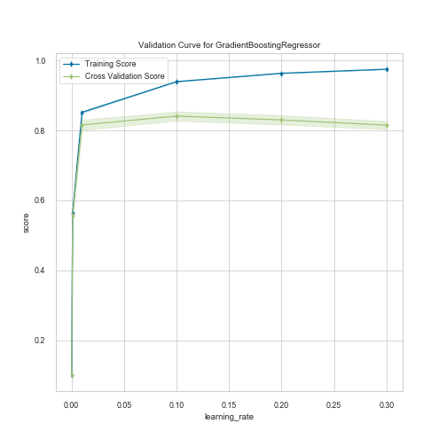
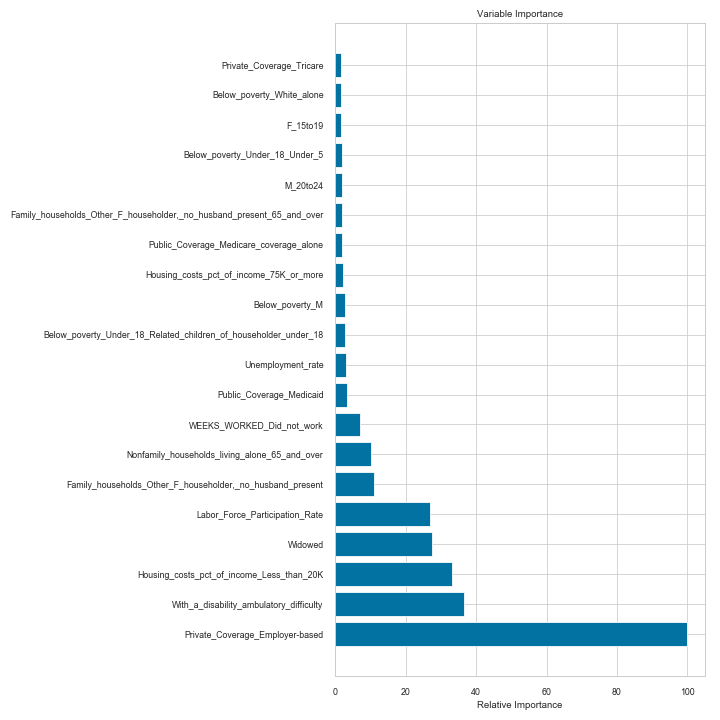
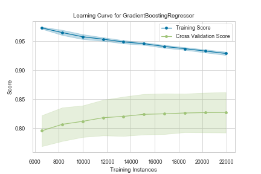

# Predicting Chronic Kidney Disease: In-Depth Analysis

​	To predict the rate of chronic kidney disease (CKD) among adults, a series of linear regression and ensemble methods were evaluated (see table below). You can see the evaluation process in [this notebook](regression_analysis_predicting_chronic_disease.ipynb). To assess generalizability, the dataset was split into a training and test set. The adjusted R2 value was calculated to determine the amount of variance in CKD explained by the model while taking the number of features into account. Mean squared error and the corresponding root mean squared error were calculated to measure the predictive accuracy and gain insight into the standard deviation of each model.

| Algorithm                    | Adjusted R2 | Mean Squared Error | RMSE   |
| ---------------------------- | ---------------------- | ------------------ | ------ |
| Stochastic Gradient Boosting | 0.8394                 | 0.1033             | 0.3214 |
| Extreme Gradient Boosting    | 0.8377                 | 0.1037             | 0.3220 |
| Bayesian Ridge Regression    | 0.8153                 | 0.1180             | 0.3435 |
| Ridge Regression             | 0.8147                 | 0.1184             | 0.3441 |
| Ordinary Least Squares       | 0.8145                 | 0.1185             | 0.3442 |
| Random Forest                | 0.8093                 | 0.1217             | 0.3489 |
| AdaBoost                     | 0.5994                 | 0.2558             | 0.5058 |

​	Of the algorithms used, Gradient Boosted Decision Trees produced the best fit models, with stochastic gradient boosting showing a slight improvement in prediction accuracy (and a decrease in overfitting) compared to XGBoost. it should be noted that the standard R2 score of the XGBoost model is higher than the stochastic gradient boosting. However, when we use the adjusted R2 to penalize features that do not add information to the model, we see that XGBoost's R2 score was being artificially inflated due to the sheer number of features. The residual plots provide a visual sense of how close the model's predictions were to the actual values. The root mean squared error (RMSE) tells us that we expect 95% of the predicted rates to be within 0.64 of the actual rate of chronic kidney disease (in other words, just over half a percent off of the actual value).

## Improving the Model

​	To improve the stochastic gradient boosting model, four hyperparameters were chosen for tuning due to their effect on reducing overfitting: the size of the tree (n_estimators), the maximum depth of the tree (max_depth), the fraction of samples to be used for fitting (subsample), and shrinkage (learning_rate). Grid search using 5-fold cross-validation was used to determine the best performance at 900 estimators. Setting the number of estimators higher produced greater overfitting. 

Validation curves were visualized to determine the remaining hyperparameters. 

 

Max depth and shrinkage appeared to perform best when set to their respective defaults. The final model utilized the following hyperparameters:

| Parameter                     | Value |
| ----------------------------- | ----- |
| Size of Tree (n_estimators)   | 900   |
| Max Depth of Tree (max_depth) | 3     |
| Learning Rate (eta)           | 0.1   |
| Subsample                     | 0.8   |

## Insights

​	While the predictive model can be useful, interpreting the model in order to gain actionable insights may prove to be more useful when designing public health campaigns. To do this, we extract the 20 most important features and rank them relative to all of the features.

​	First, we see that the model appears to mimic a Pareto distribution, where a small number of features account for most of the variation in rates of chronic kidney disease. This could prove to be useful as it will allow future efforts to focus on a few key areas to obtain the greatest effect.  As we saw during our exploratory analysis, features such as employer-based health care, labor force participation rate, and low income (relative to housing costs) near the top of this list. These can be grouped together as economic factors, indicating that areas with high predicted rates of CKD may benefit from economic development, incentivization, or assistance programs.

​	Those living with an ambulatory difficulty appear as the second most important feature. Although this is likely correlated with an economic and age component, there may also be an interaction effect between economic, social, and physical factors. This group may benefit from campaigns that combine these factors into programs that provide social assistance to prevention programming in the form of support groups and transportation. 

​	Interestingly, there are three features (widowed, single mother, and the elderly living alone) that indicate a social component to CKD prevention. Although single mothers are also likely correlated with an economic component, it may still be worth researching the effect of social interaction and intervention in the prevention of chronic kidney disease. 

​	In summary, it appears that there are three barriers to overcome in working to curb and ultimately reverse the growing rates of chronic kidney disease. First, the economic barriers to healthcare and prevention services. Second, the physical barrier to health faced by those with disabilities, especially the elderly. And third, the social component of public health that encourages preventative behaviors. Using a predictive model to focus resources, we may see improved outcomes in overcoming these barriers to health and reducing the rates of chronic kidney disease.

## Moving Forward

​	While the model appears to provide decent predictive power, there is still plenty of room to improve. We can see in the learning curve below that although the model improvement seems to have slowed down, more training data could prove to be useful in improving the model accuracy. 

​	There also remains a fair amount of overfitting that could potentially be reduced to help the model generalize to new data. This could be achieved through dimensionality reduction, regularization, or additional hyperparameter tuning. Additionally, because stochastic gradient boosting is a greedy algorithm, different seeds will lead to different results (and varying feature importance). Before embarking on expensive campaigns, it may be best to compute models with various seeds in order to generate mean outputs. This could prevent the possibility of chasing a hypothesis that was an anomaly produced by one random seed. 

*Note: one additional stochastic gradient boosting model was built with a different seed. While this did produce a slightly lower adjusted R2, the mean squared error stayed the same. Additionally, with some slight variation in order, the top 5 features (and 8 of the top 10) remained the same. However, it may be beneficial to continue testing with additional seeds and validation curves.*